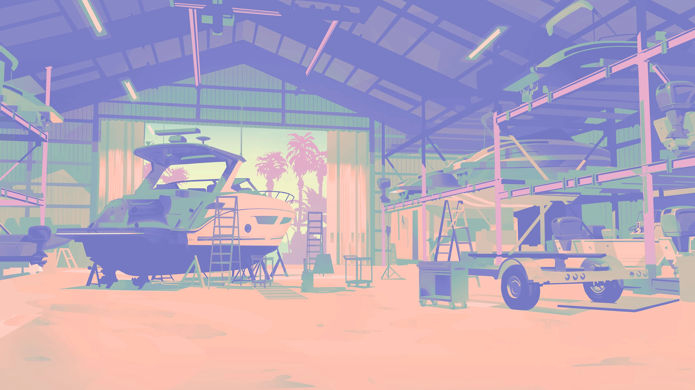
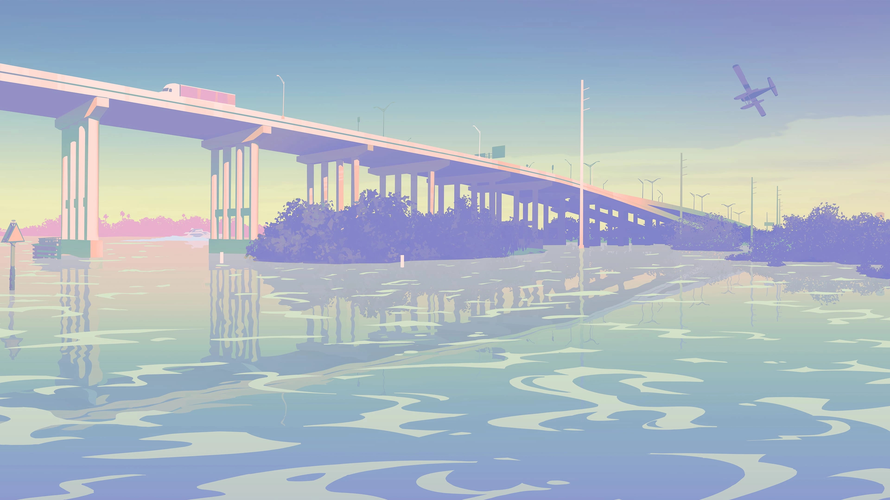
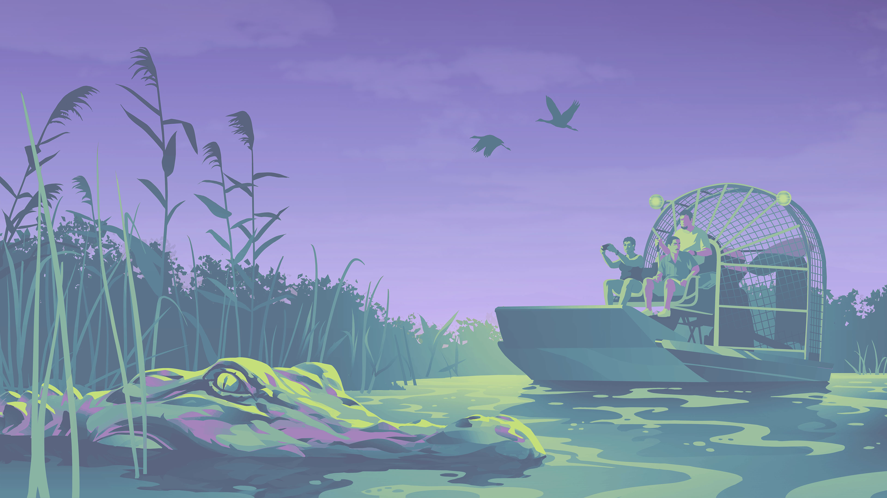
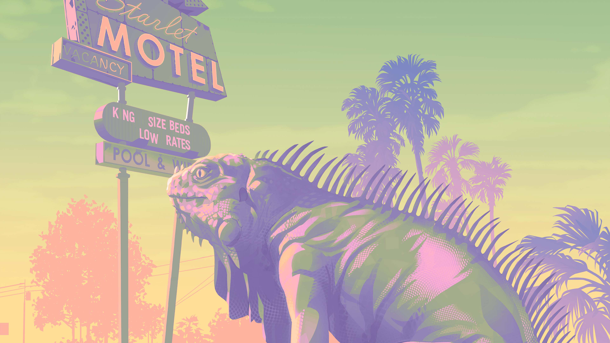
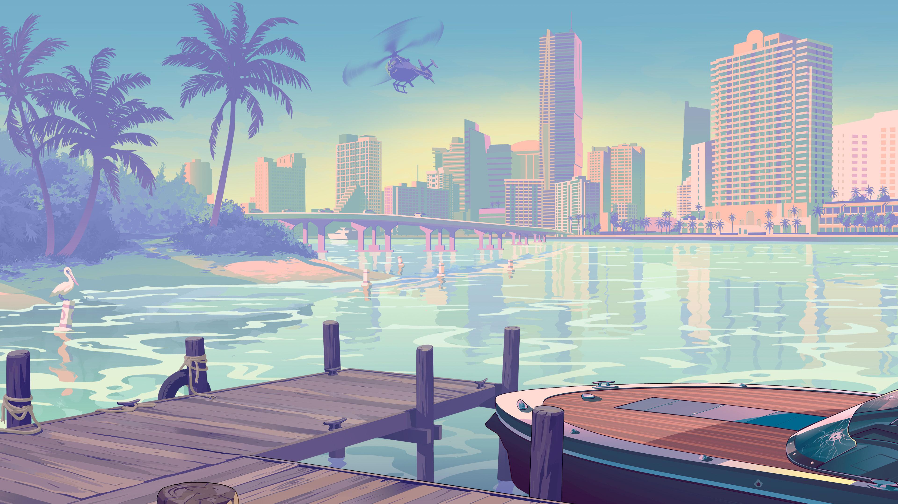
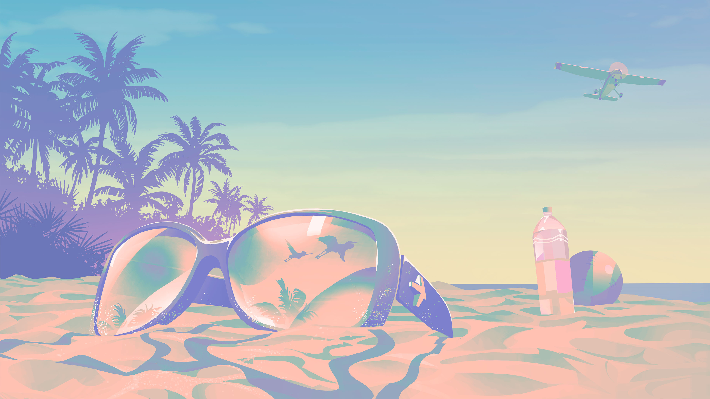
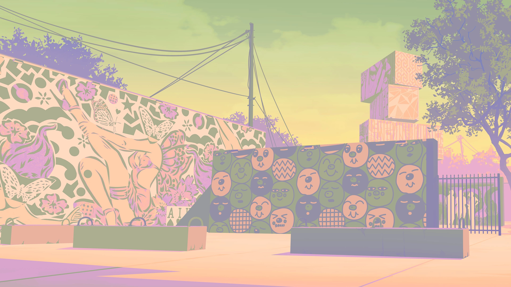
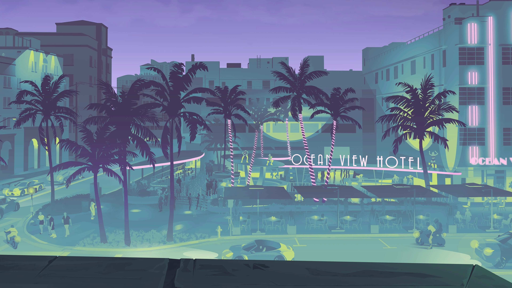
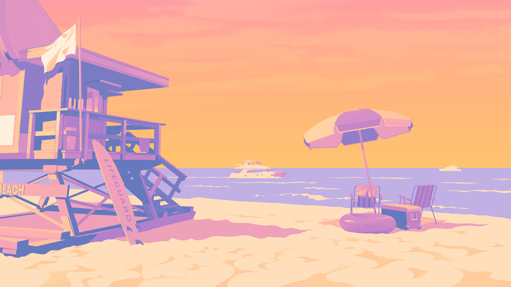

# Omarchy Florida Man Theme

GTA VI-inspired Catppuccin Frappe color scheme for Omarchy Linux.

## Preview


## Install
Use the normal Omarchy theme install method:

```bash
omarchy-theme-install https://github.com/OldJobobo/omarchy-florida-man-theme
```

## Wallpapers

| | | |
| --- | --- | --- |
|  |  |  |
|  |  |  |
|  |  |  |
|  |  |  |

## Attribution

- Waybar: modified from HANCORE-Linux's V2 waybar theme https://github.com/HANCORE-linux/waybar-themes
